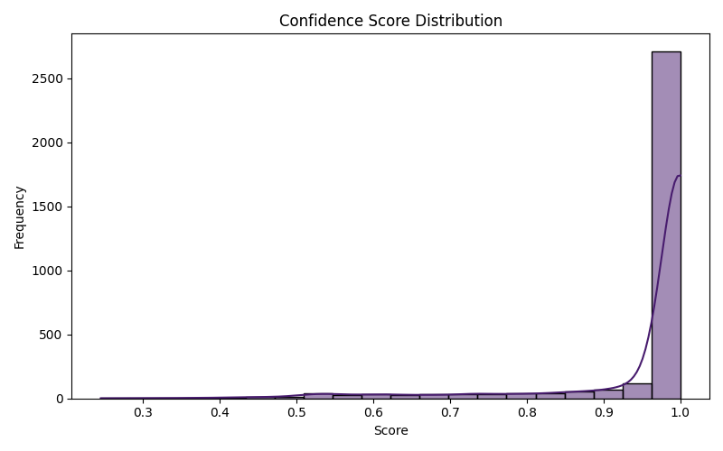
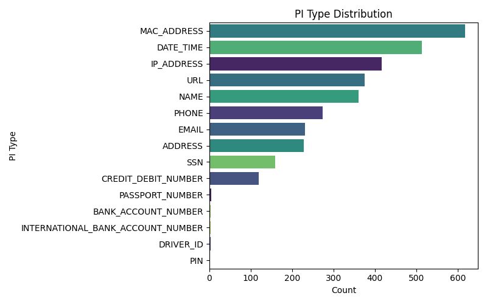

# PI Detection Report
**Generated:** 2025-05-08 15:20:47

## Summary Statistics
- Total Detections: 3310
- Unique PI Types: 15
- Average Confidence: 0.9551
- Median Confidence: 1.0000
- Fields with PI: 6
- Rows with PI: 968

## Confidence Distribution
- High Confidence (> 0.9): 87.1%
- Medium Confidence (0.7 - 0.9): 6.7%
- Low Confidence (<= 0.7): 6.2%

### Confidence Score Distribution Chart

### PI Type Distribution Chart

## Average Confidence by PI Type
| PI Type | Avg Confidence | Count |
|----------|----------------|-------|
| IP_ADDRESS | 0.9342 | 417 |
| PHONE | 0.8959 | 274 |
| CREDIT_DEBIT_NUMBER | 0.9907 | 119 |
| EMAIL | 0.9957 | 231 |
| URL | 0.9649 | 375 |
| MAC_ADDRESS | 0.8937 | 618 |
| ADDRESS | 0.9930 | 228 |
| NAME | 0.9937 | 360 |
| DATE_TIME | 0.9969 | 514 |
| SSN | 1.0000 | 159 |
| BANK_ACCOUNT_NUMBER | 0.6145 | 3 |
| INTERNATIONAL_BANK_ACCOUNT_NUMBER | 0.6412 | 3 |
| PASSPORT_NUMBER | 0.6073 | 5 |
| DRIVER_ID | 0.4821 | 3 |
| PIN | 0.5142 | 1 |